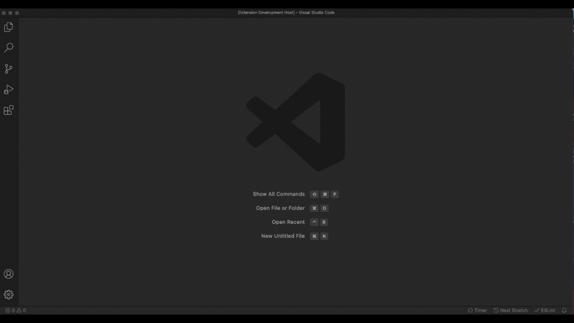

# lupex-productivity-pack README

## Features

Describe specific features of your extension including screenshots of your extension in action. Image paths are relative to this README file.

For example if there is an image subfolder under your extension project workspace:

\!\[feature X\]\(images/feature-x.png\)

## Extension Settings

This extension contributes the following settings:

-   `lupex.timer`: enable/disable the timer feature
-   `lupex.countDown.enabled`: enable/disable the count down feature.
-   `lupex.countDown.redTextLastTotSeconds`: The last tot seconds of the count down are displayed red.

### 1.0.0

Initial release of the extension.

---

**Enjoy!**
